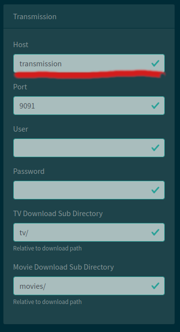

# Using transmission-tailscale with [nefarious](https://github.com/lardbit/nefarious)

## docker-compose

### Use [docker-compose.yml](https://github.com/BeardedTek/transmission-tailscale/blob/main/docker-compose.yml) and
[template.env](https://github.com/BeardedTek/transmission-tailscale/blob/main/template.env) to create your instance
of transmission-tailscale
on the same machine running nefarious.
- ```mkdir /path/to/transmission-tailscale && cd /path/to/transmission-tailscale```
- ```wget https://github.com/BeardedTek/transmission-tailscale/blob/main/docker-compose.yml```
- ```wget -O .env https://raw.githubusercontent.com/BeardedTek/transmission-tailscale/main/template.env```

### Edit .env file:
-  ```nano .env```
- ```vi .env```

```
###############################################################################
# Tailscale Settings
###############################################################################

# Enable / Disable Tailscale Functionality
TAILSCALE_ENABLE=true

# Override auto detection of docker network (ex: 192.168.1.0/24)
TAILSCALE_ADVERTISE_ROUTES=

# Use an Auth Key
# Obtain auth key at: https://login.tailscale.com/admin/settings/keys
TAILSCALE_AUTHKEY=

# "Placeshift" your presence.  You IP will appear as the public address of the
# node you enter here.  Supply the Tailscale IP address of the exit node you
# want to use
TAILSCALE_EXIT_NODE=

# Hostname as it will appear within your tailnet
TAILSCALE_HOSTNAME=transmission-tailscale

# Tag this tailscale instance.  You must define tags prior to use.
# See https://tailscale.com/kb/1068/acl-tags/#defining-a-tag
# Tags are in format tag:<tagname>
TAILSCALE_TAGS=

###############################################################################
# Docker Network Settings
# Using a docker bridge network lets us use this independently of nefarious
###############################################################################

#Docker Subnet for container to use
DOCKER_SUBNET=192.168.251.0/24

#Docker Gateway to use (must be a member of subnet
DOCKER_GATEWAY=192.168.251.1

TRANSMISSION_IP=192.168.251.201

###############################################################################
# NFS Settings
###############################################################################

# Enable NFS inside container
NFS_ENABLE=true

# IP/fqdm of NFS Server
NFS_IP=192.168.1.111

# Full path to NFS Share
NFS_SHARE=/path/to/share

# Mount point inside container
NFS_MOUNT_POINT=/downloads
```

### Bring it up
```docker-compose up -d```

You can then view the logs using
```docker-compose logs -f```


Once up and running, change Transmission Host setting to the
TRANSMISSION_IP you set in your .env file.



That's it!  Nefarious will now use transmission-tailscale for downloads!